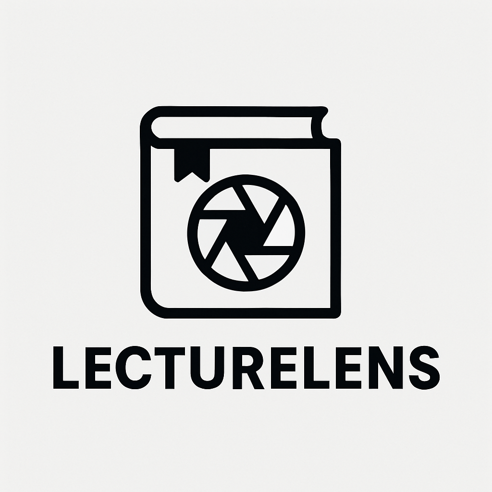

# 🎓 LECTURELENS
### AI 기반 강의 자동요약 · PDF 생성 서비스
**RAG(Retrieval-Augmented Generation)** 기반으로  
PDF / PPT / Word / Audio(MP3/MP4) 강의를 업로드하면  
**시험 대비용 요약노트를 자동으로 생성**해주는 서비스입니다.

🚀 *“1시간 강의 → 1~3장 시험요약 PDF로 자동 변환”*

---

## ✨ 주요 기능 (Features)

### 📁 1. 강의 업로드
- PDF / PPT / PPTX / DOC / DOCX 문서 업로드
- MP3 / MP4 / AVI 등 음성·영상 파일 업로드
- S3에 원본 저장 후 자동 변환(PDF/MP4)

### 🎙️ 2. 음성 → 텍스트(STT)
- 업로드된 음성/영상 파일을 STT 처리
- 자동 문장 분리 및 청크(chunk) 생성

### 📄 3. 문서 변환 & Parsing
- PDF, PPT, DOC 문서를 모두 PDF로 변환
- 페이지 단위 → 문단 단위 → chunk 로 나누어 벡터화

### 🧠 4. RAG 기반 요약 생성
- PDF 청크 + 음성 청크를 통합하여 retrieval
- 중요도 기반 re-ranking + hybrid search
- 시스템 프롬프트 기반 **시험 대비 요약노트 생성**

### 📘 5. 고품질 PDF 요약 생성기
- 제목/소제목 스타일 자동 적용
- Bold, 색상, bullet, emoji 등 학습자 친화적 스타일 적용
- 길면 페이지 넘김 처리, 마크다운 자동 제거
- A4 포맷으로 읽기 쉬운 시험 요약 PDF 생성

---

## 🧱 기술 스택 (Tech Stack)

### **Frontend**
- React + TypeScript + Vite
- TailwindCSS
- Axios
- React Icons

### **Backend**
- Spring Boot 3 (Java 17)
- Spring Security (JWT + OAuth2 Google Login)
- Spring Web / Validation
- PostgreSQL + pgvector
- JPA + HikariCP
- OpenAI GPT-4.1 / Embeddings API
- Apache PDFBox (PDF 생성 엔진)

### **Infrastructure**
- AWS EC2 (Ubuntu)
- AWS S3 (파일 저장)
- NGINX (Reverse Proxy)
- Docker (Postgres + pgvector)
- SSH Tunneling (개발 DB 접근)

---

## 🔐 인증(Auth) 구조

### Google OAuth2 Login
- `/oauth2/authorization/google` → Google Consent Screen
- 로그인 성공 시 → Backend Redirect → JWT 발급 → 프론트 전달

### JWT 기반 권한 처리
- Access Token 만료 → Refresh Token으로 자동 갱신
- Refresh Token은 Redis/DB에 저장해 도난 방지

---

## 📚 RAG 파이프라인 구조

1. **강의 파일 업로드**
2. **문서(PDF) & 오디오(STT) 변환**
3. **청크(chunk) 생성**
4. **embedding 서비스 호출 → pgvector 저장**
5. **retrieval (semantic search + importance score)**
6. **프롬프트 엔지니어링 적용 → summarization 생성**
7. **PDF Renderer로 요약 PDF 출력**

